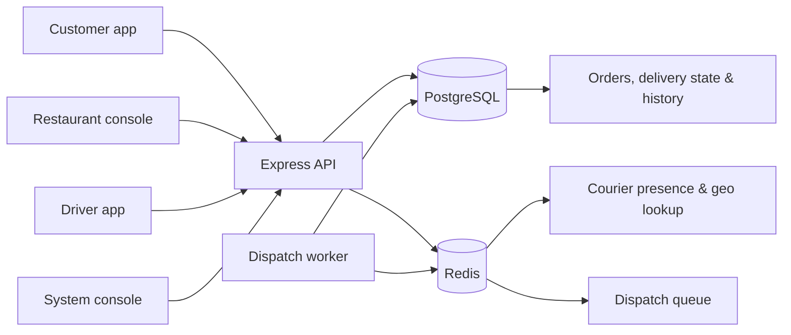

# Voro

<div align="center">
  

  **A multi-role food delivery platform for customers, restaurants, couriers, and operations.**

  [Run locally](#quick-start-with-docker) · [Apps](#applications) · [Architecture](#architecture) · [Delivery simulator](#test-live-delivery-tracking)
</div>

---

## What is Voro?

Voro is a full-stack delivery workspace built around one order lifecycle:

1. A customer discovers a restaurant, builds a cart, selects an address, and checks out.
2. The restaurant accepts and prepares the order.
3. The dispatch worker finds an available courier near the restaurant.
4. The courier accepts the offer, picks up the order, and starts the delivery.
5. The customer follows the courier on a live map until delivery is complete.

The project contains four independent React applications backed by one Express API, PostgreSQL, and Redis.

## Applications

| App | Local URL | What it is for |
| --- | --- | --- |
| Customer app | `http://localhost:5173` | Discover restaurants, manage cart and checkout, save addresses/cards, track active orders. |
| Restaurant console | `http://localhost:5174` | Receive orders, manage preparation status, menu, and restaurant workspace. |
| Driver app | `http://localhost:5175` | Go online, share location, accept offers, view route and cash/change details, complete deliveries. |
| System console | `http://localhost:5176` | Create restaurant/courier accounts, manage operational data, and view analytics. |
| API health | `http://localhost:5000/health` | Health status for the API, PostgreSQL, and Redis. |

## Key capabilities

### Customer

- Restaurant discovery with food-category filters.
- Cart, dedicated checkout, and saved delivery addresses.
- Demo card checkout or cash-on-delivery with entered tendered amount and calculated change.
- Order history and multi-order live tracking.
- Animated courier position on OpenStreetMap/Leaflet maps.
- Customer profile, payment methods, preferences, and Serbian/English UI.

### Restaurant

- Private restaurant workspace and account setup.
- Incoming order workflow and preparation status changes.
- Menu and restaurant details management.
- Restaurant-facing operational analytics.

### Driver

- Online/offline availability with continuous location heartbeats.
- Nearby dispatch offers with accept/decline flow.
- Pickup, on-the-way, and delivered status workflow.
- Live route view, pickup code, and cash/change instructions.
- Earnings and delivery history overview.

### System console

- Restaurant and courier creation with private console/setup invitations.
- Address suggestions with resolved coordinates.
- Operational lists and restaurant analytics.

## Architecture



### Backend responsibilities

- JWT authentication, refresh tokens, role-based access, email verification, and password reset.
- PostgreSQL as the source of truth for users, restaurants, menus, orders, payments, and deliveries.
- Redis for catalog/address caching, dispatch queueing, and live courier presence/geo lookup.
- A background dispatch worker that offers eligible orders to nearby available couriers.
- OpenStreetMap tiles and OSRM routing for map and route visualisation.

## Tech stack

| Layer | Technologies |
| --- | --- |
| Frontend | React 19, TypeScript, Vite, React Router, Redux Toolkit, Tailwind CSS, Leaflet / React Leaflet |
| Backend | Node.js, Express 5, TypeScript, JWT, bcrypt, Nodemailer |
| Data | PostgreSQL 16, Redis 7 |
| Local infrastructure | Docker, Docker Compose |

## Quick start with Docker

This is the recommended way to run the full platform. It starts PostgreSQL, Redis, migrations, the dispatch worker/API, and all four apps.

### Prerequisites

- Docker Desktop
- Docker Compose

### Start everything

```powershell
Copy-Item .env.docker.example .env.docker
docker compose --env-file .env.docker up --build -d
```

The local Docker setup uses demo data by default (`SEED_DEMO_DATA=true`).

### Inspect or stop services

```powershell
# Service status
docker compose --env-file .env.docker ps

# API and dispatch-worker logs
docker compose --env-file .env.docker logs -f backend

# Stop containers while preserving PostgreSQL and Redis data
docker compose --env-file .env.docker down

# Reset all local Docker data, including the database
docker compose --env-file .env.docker down -v
```

> For any non-local environment, change `JWT_SECRET`, `PAYMENT_CARD_ENCRYPTION_KEY`, database credentials, and SMTP values before starting services.

## Native development

Use this when you want Vite hot reload and a TypeScript server process.

### 1. Start PostgreSQL and Redis

You need PostgreSQL and Redis running locally. The default server environment expects:

```text
PostgreSQL: localhost:5432 / database: voro / user: admin / password: admin
Redis:      redis://localhost:6379
```

You can change these values in `server/.env`. If you use the Docker database from the host machine, set `DB_PORT=5433`.

### 2. Run the API

```powershell
cd server
Copy-Item .env.example .env
npm install
npm run migrate
npm run seed:demo
npm run dev
```

`npm run dev` starts the API and its dispatch worker. `npm run seed:demo` is explicit by design, so normal migrations never insert demo records accidentally.

### 3. Run the client apps

Open another terminal:

```powershell
cd client
npm install
npm run dev:all
```

To run just one app:

```powershell
npm run dev:customer
npm run dev:restaurant
npm run dev:driver
npm run dev:admin
```

## Demo accounts

After `npm run seed:demo`, all seeded accounts use:

```text
password123
```

| Role | Example account |
| --- | --- |
| Admin | `admin@seed.voro.test` |
| Restaurant | `restaurant.pizzeria-trg@voro.test` |
| Driver | `marko.jovanovic@driver.voro.test` |
| Customer | `customer.ana@seed.voro.test` |

The demo seed creates Belgrade-based restaurants, menu items, customer addresses, couriers, coordinates, and test orders.

## Test live delivery tracking

The driver location simulator is a local development tool. It writes courier location to PostgreSQL, Redis, and the active delivery location stream.

```powershell
cd server
npm run simulate:driver
```

Default behavior:

1. Moves **Marko Jovanović** toward **Domaće palačinke**.
2. Waits in front of the restaurant.
3. When the driver app marks the delivery as **On the way**, follows the OSRM driving route to the customer.
4. Keeps the courier position live on the customer tracking map.

Useful options:

```powershell
# Use a specific restaurant and a faster simulation
npm run simulate:driver -- --restaurant-id 51 --step 20 --interval 1000

# Update one location once, then exit
npm run simulate:driver -- --once

# Show all options
npm run simulate:driver -- --help
```

While the simulator runs, it holds a short Redis lease so an open driver tab cannot overwrite its simulated location. Stopping the script releases the lease automatically.

## Build commands

```powershell
# API TypeScript build
cd server
npm run build

# Build every frontend workspace
cd ../client
npm run build
```

## Repository layout

```text
voro/
├── client/
│   ├── apps/
│   │   ├── admin-app/          # System console
│   │   ├── customer-app/       # Customer marketplace and checkout
│   │   ├── driver-app/         # Courier workspace and map
│   │   └── restaurant-app/     # Restaurant console
│   └── packages/               # Shared UI, socket, and application packages
├── server/
│   └── src/
│       ├── api/                # Routes, controllers, middleware
│       ├── database/           # Migrations and demo seed
│       ├── repositories/       # PostgreSQL data access
│       ├── scripts/            # Local development tools
│       ├── services/           # Auth, dispatch, Redis, maps, payments
│       └── workers/            # Dispatch worker
├── docker-compose.yml
├── .env.docker.example
└── CHANGELOG.md
```

## Environment variables

Use `server/.env.example` and `.env.docker.example` as templates. The important values are:

| Variable | Purpose |
| --- | --- |
| `PORT` | API port, defaults to `5000`. |
| `DB_HOST`, `DB_PORT`, `DB_NAME`, `DB_USER`, `DB_PASSWORD` | PostgreSQL connection. |
| `REDIS_URL` | Redis connection URL. |
| `JWT_SECRET` | Secret used to sign access and refresh tokens. |
| `PAYMENT_CARD_ENCRYPTION_KEY` | Encryption key for stored payment-card data. |
| `CLIENT_URLS` | Allowed frontend origins for CORS. |
| `SMTP_*` | Optional email delivery configuration. |

## Notes

- Card checkout is a local/demo payment flow until a payment processor is connected.
- Cash orders retain the tendered amount and calculated change for the driver.
- Map tiles and driving routes require network access to OpenStreetMap and the public OSRM service.

## Author

Nikola Pantelić

---

Built as an educational full-stack delivery platform.
